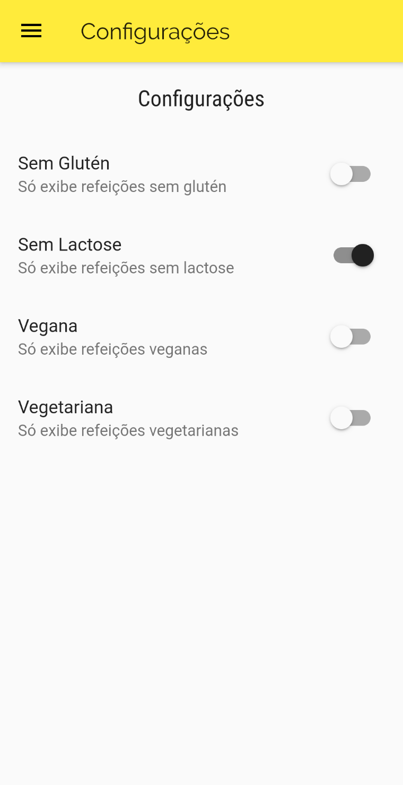

# Receitas

Projeto de um aplicativo para exibir diversas receitas, podendo filtrar algumas opções utilizando Flutter.

## Sobre

Projeto feito para aprendizado e aperfeiçoamento de alguns conceitos como:
- Navegação com rotas
- Menu de navegação com tabs
- Gerenciamento de estados

Nesse projeto foi trabalhado o gerenciamento de estado para atualizar as receitas visíveis após selecionar um filtro, favoritar uma receita e ser adicionada a aba de favoritos.
  
Também foi implementado a navegação com rotas utilizando o Navigator, e uma BottomNavigationBar para a navegação com tabs entre as categorias e as receitas favoritadas.

## Screenshots

  
  
  
  
  
  
  
  

